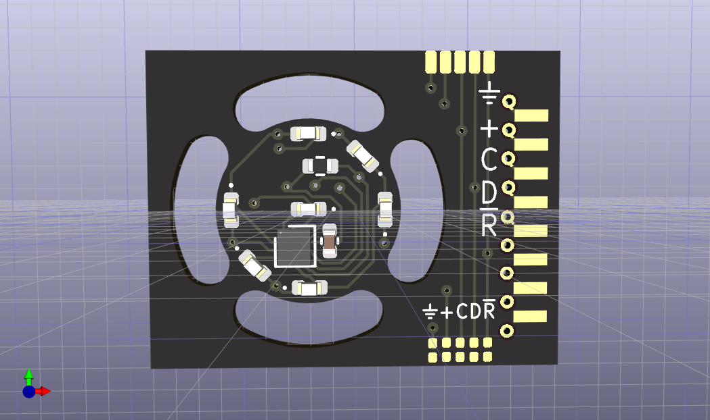

PRR Position Light Signals based on an ATTiny20
-----------------------------------------------

A panel of my design with a 1mm grid shown.

The Pennsylvania Railroad (PRR), almost uniquly among railroads, used
Position Light Signals (PLS) 
[[1]](https://en.wikipedia.org/wiki/North_American_railroad_signals#Position_light_signals)
[[2]](https://railroadsignals.us/signals/pl/pl.htm). (The Norfolk & Western
used Colored Position Lights (CPL) 
[[2]]([https://railroadsignals.us/signals/pl/pl.htm) which were similar.)

I model [N-Scale](https://en.wikipedia.org/wiki/N_scale) which is 1:160
scale. From scans of PRR plans
[[3]](http://prr.railfan.net/signalstandards/standards.cgi?plan=S-401-D&frame=YES&sortdir=up&sortby=1&rr=all)
the diameter of the signal is 4'4", which becomes 0.325" (8.255mm) for the
scale model.

I've designed the system to use 3 wires: +5V, Ground, and Serial. Serial
data comes in, the first command extracted, and then the remainder of a packet
is retransmitted similar to how WS2812b / NeoPixels work. A packet starts with
an ASCII '!' (0x41) followed a sequence of 'S' (0x53) for Stop, 'A' (0x41) for
Approach, and 'C' (0x43) for Clear, 'O' (0x4F) for all lights off, and anything
above 0x80 to control the individual lights. (Invalid characters will turn
all lights off.)
