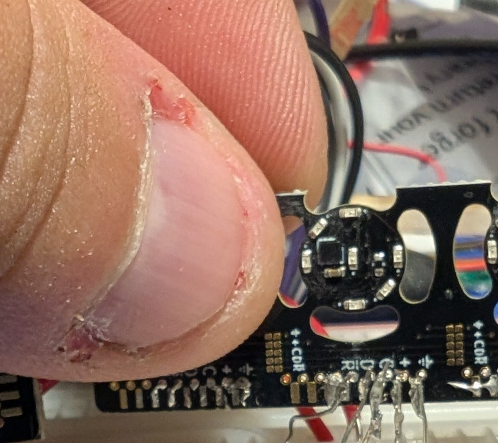
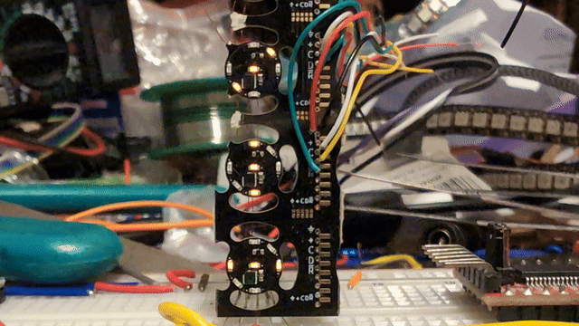
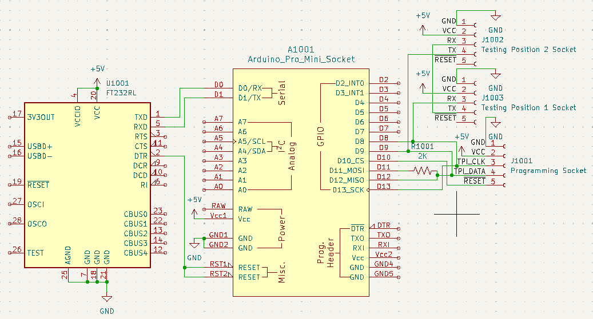

PRR Position Light Signals based on an ATTiny20
-----------------------------------------------
Thumb for scale.

In Action!

The Pennsylvania Railroad (PRR), almost uniquly among railroads, used
Position Light Signals (PLS) 
[[1]](https://en.wikipedia.org/wiki/North_American_railroad_signals#Position_light_signals)
[[2]](https://railroadsignals.us/signals/pl/pl.htm). (The Norfolk & Western
used Colored Position Lights (CPL) 
[[2]]([https://railroadsignals.us/signals/pl/pl.htm) which were similar.)

I model [N-Scale](https://en.wikipedia.org/wiki/N_scale) which is 1:160
scale. From scans of PRR plans
[[3]](http://prr.railfan.net/signalstandards/standards.cgi?plan=S-401-D&frame=YES&sortdir=up&sortby=1&rr=all)
the diameter of the signal is 4'4", which becomes 0.325" (8.255mm) for the
scale model.

I've designed the system to use 3 wires: +5V, Ground, and Serial. Serial
data comes in, the first command extracted, and then the remainder of a packet
is retransmitted similar to how WS2812b / NeoPixels work. A packet starts with
an ASCII '!' (0x41) followed a sequence of 'S' (0x53) for Stop, 'A' (0x41) for
Approach, and 'C' (0x43) for Clear, 'O' (0x4F) for all lights off, and anything
above 0x80 to control the individual lights. (Invalid characters will turn
all lights off.) I'm currently planning to use a software UART at 300baud.

I am using an 
[ATTiny20](https://ww1.microchip.com/downloads/en/DeviceDoc/Atmel-8235-8-bit-AVR-Microcontroller-ATtiny20_Datasheet.pdf)
in a 
[WLCSP](https://en.wikipedia.org/wiki/Wafer-level_packaging) package 
(1.56mm&times;1.4mm) with 0.4mm balls, and I'm not sure I can solder that
at my current skill level.) I'm just bemused at it's physical size, even if
it only has 128 bytes of RAM. It fits perfectly in the area available,
allows for components on a single side, and has enough I/O to control
the LEDs individually. In order to avoid having to place a resistor per
LED, I'm using the pull-up resistors in the microcontroller. Since these
are large-resistance resistors, it limits the brightness of the LEDs. While
the pull-up resistors aren't any specific resistance and can be pretty
variable, the ones within a single chip should be pretty similar. This may
mean that signals visibility near each other may be of different brightness,
but so far it doesn't appear to be a noticeable issue.

The limited brightness is a potential problem, but I'm going to try up the
effective PWM duty cycle. If each light is updated sequentually at the
frequency at which the RX pin is sampled spread over the 7 lights -- 
currently 1200Hz with a 1/7 (14%) duty cycle. Because the LEDs are
charliplexed I am limited in which LEDs I could turn on simultaneously.
However, because I separated out the center light and I think lucked into
arranging the lights in a sensible order I am able to have them on with
100% duty cycle for the 3 basic aspects these display (Stop, Clear, and
Approach). For those aspects I think the current brightness is adequate.

Here is how I test and program these modules. The Arduino is running [this
sketch](tpi_programmer/) from (Junk +
Arduino)[https://junkplusarduino.blogspot.com/p/attiny10-resources.html]. I
added a software serial console to it. The FT232RL in the schematic is 
actually a breakout board that provides the +5V.

My next step is to use 38 gauge (40mil (0.1007mm) diameter) enameled wire to
wire the signals into a wayside signal on a post, and then a signal bridge.
