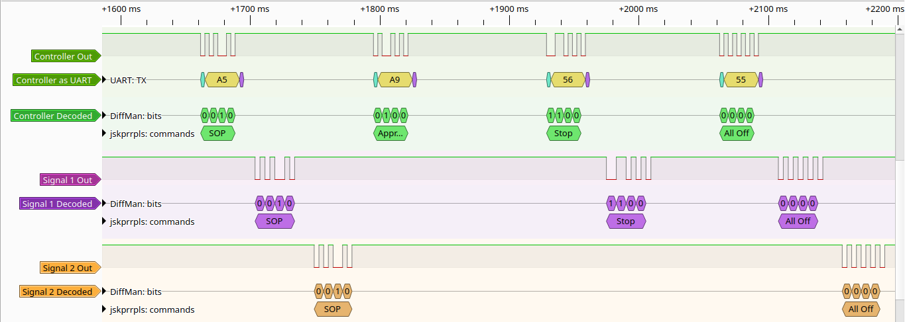
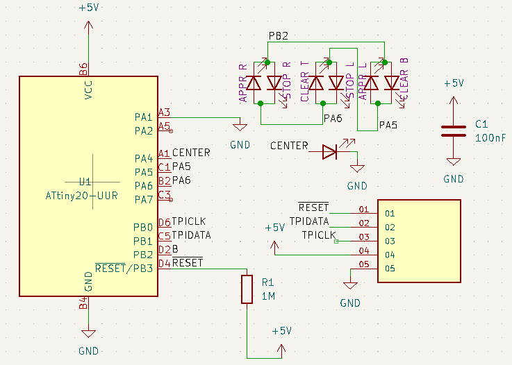
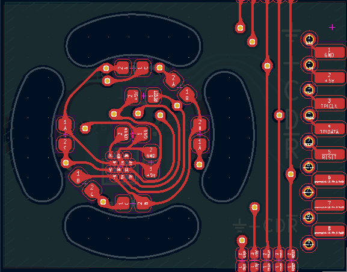
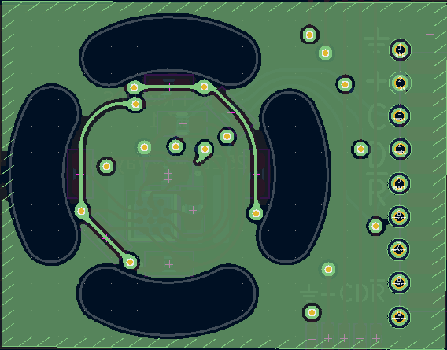
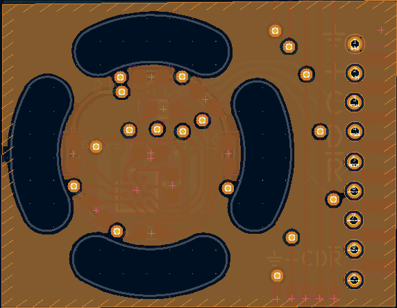
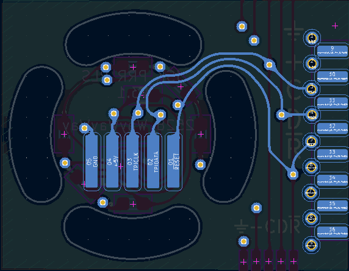

PRR Position Light Signals based on an ATTiny20
-----------------------------------------------
Thumb for scale.

In Action!

The Pennsylvania Railroad (PRR), almost uniquely among railroads, used
Position Light Signals (PLS) 
[[1]](https://en.wikipedia.org/wiki/North_American_railroad_signals#Position_light_signals)
[[2]](https://railroadsignals.us/signals/pl/pl.htm). (The Norfolk & Western
used Colored Position Lights (CPL) 
[[2]]([https://railroadsignals.us/signals/pl/pl.htm) which were similar.)

I model [N-Scale](https://en.wikipedia.org/wiki/N_scale) which is 1:160
scale. From scans of PRR plans
[[3]](http://prr.railfan.net/signalstandards/standards.cgi?plan=S-401-D&frame=YES&sortdir=up&sortby=1&rr=all)
the diameter of the signal is 4'4", which becomes 0.325" (8.255mm) for the
scale model.

I've designed the system to use 3 wires: +5V, Ground, and Serial. Serial
data comes in, the first command extracted, and then the remainder of a packet
is retransmitted similar to how WS2812b / NeoPixels work. 

Protocol
========

The serial protocol is 
[Differential Manchester](https://en.m.wikipedia.org/wiki/Differential_Manchester_encoding)
, but kind of overlaid on
a double-baud UART frame, so it always starts with the "0" stop bit.

I moved to this from just a plain software UART as the timing on some of my
signals was off by a large enough amount to throw everything out of sync.
Decoding the differential Manchester packet is much less timing-sensitive.
It runs at 300baud/150bps with 4-bit packets.

A packet starts with an 0x4 followed a sequence of 0x3 for Stop, 0x2 for
Approach, and 0x1 for Clear, 0x0 for all lights off.

In this example, the controller sends out a 4-frame packet. Starting with a SOP (Start of Packet) frame, followed
by an Approach, then Stop, then All Off. The first signal dutifully forwards
the SOP frame. The second frame is for it, though, so it does not forward 
that one. The rest of the frames are for subsequent signals, so it forwards
all subsequent frames until a SOP is encountered again. The second signal
does as the first. It forwards the SOP, keeps the frame following the SOP,
and forwards any remaining frames until another SOP is encountered.

Also, note how when interpreted as a UART, the packets coming from the signals
isn't in sync with the baudrate. I'm sure that there's some way to get a more
stable clock on the μC, but it was significantly easier for me to switch to a
more forgiving line coding. 

(The visualization is from PulseView/sigrok. I wrote a custom protocol
decoder to help me debug.)

Schematics / PCB
================

### General Notes

I am using an 
[ATTiny20](https://ww1.microchip.com/downloads/en/DeviceDoc/Atmel-8235-8-bit-AVR-Microcontroller-ATtiny20_Datasheet.pdf)
in a 
[WLCSP](https://en.wikipedia.org/wiki/Wafer-level_packaging) package 
(1.56mm&times;1.4mm) with 0.4mm balls, and I'm not sure I can solder that
at my current skill level.) I'm just bemused at it's physical size, even if
it only has 128 bytes of RAM. It fits perfectly in the area available,
allows for components on a single side, and has enough I/O to control
the LEDs individually.

In order to avoid having to place a resistor per
LED, I'm using the pull-up resistors in the microcontroller. Since these
are large-resistance resistors, it limits the brightness of the LEDs. While
the pull-up resistors aren't any specific resistance and can be pretty
variable, the ones within a single chip should be pretty similar. This may
mean that signals visibility near each other may be of different brightness,
but so far it doesn't appear to be a noticeable issue.

The limited brightness is a potential problem, but I'm going to try up the
effective PWM duty cycle. If each light is updated sequentially at the
frequency at which the RX pin is sampled spread over the 7 lights -- 
currently 1200Hz with a 1/7 (14%) duty cycle. Because the LEDs are
charliplexed I am limited in which LEDs I could turn on simultaneously.
However, because I separated out the center light and I think lucked into
arranging the lights in a sensible order I am able to have them on with
100% duty cycle for the 3 basic aspects these display (Stop, Clear, and
Approach). For those aspects I think the current brightness is adequate.

### PCB Notes

The PCB design is fairly simple, and using 4 layers (Signal, +5V+Minimal Signal,
GND, Signal) made routing easier.

To avoid using via-in-pads (and being charged accordingly), there are 3 pins
(balls?) that aren't used. If they had been used, each LED could have been
directly connected to the μC. As such, I was able to control the LEDs
individually by charlieplexing them.

I used a 1.27mm pitch SOIC chip clip as my connectorless connector. (I did
manage to make the through-holes a little too small, so it doesn't attach
as securely as I would have liked.) Eventually I just soldered some THT
resistor legs to these to connect to a breadboard for some of the signal
heads.

When panalized, I added some traces that I can use to interconnect columns
for testing.

### Individual Schematic

### Front Copper

### Inner 1 Copper

### Inner 2 Copper

### Back Copper

Programming and Testing
========================

Here is how I test and program these modules. The Arduino is running [this
sketch](tpi_programmer/) from (Junk +
Arduino)[https://junkplusarduino.blogspot.com/p/attiny10-resources.html]. I
added a software serial console to it to make testing easier. The FT232RL in
the schematic is actually a breakout board that provides the +5V.

My next step is to use 38 gauge (40mil (0.1007mm) diameter) enameled wire to
wire the signals into a wayside signal on a post, and then a signal bridge.
